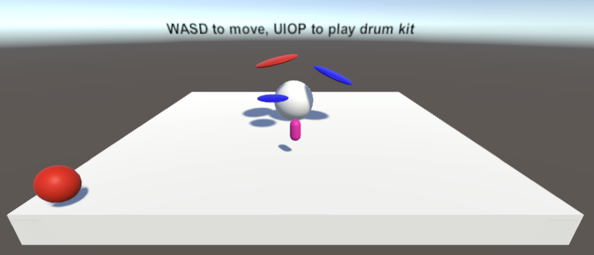

# RNBO Unity Audio Plugin

*This is experimental software—use at your own risk, and know that anything in this repository could change in the future.*


Here we implement a Native Audio Plugin for Unity as well as a helper object that facilitates working with that plugin.

After following the steps below, visit the `docs/` directory to learn more about working with [RNBO in Unity](docs/INDEX.md).

You can also check out a working example of [a drumkit and a humming orb](https://cycling74-assets.nyc3.digitaloceanspaces.com/rnbo/unity/example-projects/RNBODrumkit.zip).



## Project organization

There are two pieces to this project.

The first piece is our **RNBOTypes** package. This contains C# code that your custom plugin 
export will reference. If you create multiple plugins, they will all reference the same **RNBOTypes** 
package.

The second piece is our [NativeAudioPlugin](https://docs.unity3d.com/Manual/AudioMixerNativeAudioPlugin.html) implementation and helper script.  This contains the
adapter code you need to convert your RNBO C++ export into a plugin that you can load in Unity.

### File Structure and Building

Please make sure you are using RNBO version `1.1.1` or later. This version comes bundled by default with Max `8.5.4`.

If you are building on Windows, find the [Windows-specific notes](#building-for-windows) below. You can also find some notes that are [Android-specific](#building-for-android-including-the-quest-2) if you are using that platform (for example, to build a VR project for the Oculus Quest).

The source code of the Plugin itself is in the `src/` directory. In general use of this repository, you shouldn't need to change anything in that directory.

Some notable directories:

| Location                          | Explanation   |
| --------------------------------- | ------------- |
| src/                              | Source for the RNBO Plugin and helper object |
| RNBOTypes/  | A dependency for the built Plugin — you'll install this into your Unity Project |
| export/                           | You can create this folder and export your code here for an easy default experience |
| build/          | You can create this folder to build your Plugin package |

We use [CMake](https://cmake.org/) to actually build the plugin and its package. [Export your patcher](https://rnbo.cycling74.com/learn/the-cpp-source-code-target-introduction) to a subdirectory
you make called `export` in this repo's root directory, next to the `src` directory, and if your export is called `rnbo_source.cpp`, you can run the following commands in your terminal to build with CMake. 

Start by opening a terminal in the root of this `/rnbo.unity.audioplugin` directory. Then run:

```sh
mkdir build
cd build
cmake .. -DPLUGIN_NAME="My Custom Plugin"
cmake --build .
```
If you change the name of your export from `rnbo_source.cpp` in RNBO's export sidebar, you can either change the CMake variable `RNBO_CLASS_FILE_NAME` in `CMakeLists.txt` or use the CMake flag `-DRNBO_CLASS_FILE_NAME` when you run `cmake ..`

For example:

```sh
mkdir build
cd build
cmake .. -DRNBO_CLASS_FILE_NAME="my_custom_plugin.cpp" -DPLUGIN_NAME="My Custom Plugin"
cmake --build .
```

You can also export your c++ code into and build from some other location, other than `export/` and `build/`.
You'll need to tell CMake where to find your export dir and likely also your RNBO c++ library code.
This can be useful if you want to build several unique plugins from unique RNBO exports.

For example:

```sh
mkdir build-synth
cd build-synth
cmake .. -DRNBO_EXPORT_DIR=/Users/xnor/Documents/export/simple-freq-param -DRNBO_CPP_DIR=/Users/xnor/Documents/export/simple-freq-param/rnbo -DPLUGIN_NAME="Simple Freq Param" 
cmake --build .
```

After building, you should see a folder in your `/build` directory called **My Custom Plugin**. This should contain
all you need to install it as a package in Unity.

### Building for Windows

If you are building on Windows, you may need to give a `--config` flag in the build step in order to build a Release build as opposed to a Debug build. You can do so with:

```sh
cmake --build . --config Release
```

### Building for Android (including the Quest 2)

If you've installed the NDK via Unity Hub, you should be able to find it here:

* On macOS:
  * `/Applications/Unity/Hub/Editor/<YOUR EDITOR VERSION>/PlaybackEngines/AndroidPlayer/NDK/`
  * eg: `/Applications/Unity/Hub/Editor/2021.3.23f1/PlaybackEngines/AndroidPlayer/NDK/`
* On Windows:
  * `C:\Program Files\Unity\Hub\Editor\<YOUR EDITOR VERSION>\Editor\Data\PlaybackEngines\AndroidPlayer\NDK`
  * eg: `C:\Program Files\Unity\Hub\Editor\2021.3.23f1\Editor\Data\PlaybackEngines\AndroidPlayer\NDK`

The NDK includes a CMake **toolchain** file, which makes our life easy.
You simply provide the `CMAKE_TOOLCHAIN_FILE`, `ANDROID_PLATFORM` and `ANDROID_ABI` settings in addition to your other CMake parameters.

The `ANDROID_PLATFORM` is the minimum Android version you would like to target.
The `ANDROID_ABI` is the CPU binary interface that your plugin should target. See [the NDK ABIs Guide](https://developer.android.com/ndk/guides/abis) for more info.

For instance, if you want to build and run on the `Oculus Quest 2`, the documentation says to use a minimum android version of `29` and `arm64-v8a` as the `ABI`. 

The example below demonstrates this with a macOS user account called `xnor`.

```
mkdir build && cd build
cmake .. \
  -DANDROID_PLATFORM=29 \
  -DANDROID_ABI=arm64-v8a \
  -DCMAKE_TOOLCHAIN_FILE=/Applications/Unity/Hub/Editor/2021.3.23f1/PlaybackEngines/AndroidPlayer/NDK/build/cmake/android.toolchain.cmake \
  -DRNBO_EXPORT_DIR=/Users/xnor/Documents/export/simple-freq-param \
  -DRNBO_CPP_DIR=/Users/xnor/Documents/export/simple-freq-param/rnbo -DPLUGIN_NAME="Simple Freq Param" 
cmake --build .
```

Once you've built your package, you'll probably want to build a native version so you can load the plugin in your editor, then copy that into the package you built above.

```
mkdir build-native && cd build-native
cmake .. \
  -DRNBO_EXPORT_DIR=/Users/xnor/Documents/export/simple-freq-param \
  -DRNBO_CPP_DIR=/Users/xnor/Documents/export/simple-freq-param/rnbo -DPLUGIN_NAME="Simple Freq Param" 
cmake --build .
cp -r SimpleFreqParam/Assets/Plugins/Darwin ../build/SimpleFreqParam/Assets/Plugins/
```

Then install your package into your Unity project.


## Resources

* [RNBO](https://rnbo.cycling74.com/)
* [RNBO Licensing FAQ](https://support.cycling74.com/hc/en-us/articles/10730637742483-RNBO-Export-Licensing-FAQ)
* [Unity](https://unity.com/)
  * [NativeAudioPlugins](https://github.com/Unity-Technologies/NativeAudioPlugins)
  * [NativeAudioPlugins Docs](https://docs.unity3d.com/Manual/AudioMixerNativeAudioPlugin.html)
  * [Package Manifest Docs](https://docs.unity3d.com/Manual/upm-manifestPkg.html)
  * [Assembly Definition docs](https://docs.unity3d.com/Manual/ScriptCompilationAssemblyDefinitionFiles.html)
* [cmake](https://cmake.org/)

## Known Issues

* **Transport Memory Leak:** if you create a lot of transports, they won't be deallocated, so you're better off re-using transports (rather than creating a new transport each time you need one) if you need more granular transport control than the global transport provides.

## TODO

* Support additional platforms. Currently we support MacOS, 64-bit Linux, 64-bit Windows, and Android (including the Quest 2).
