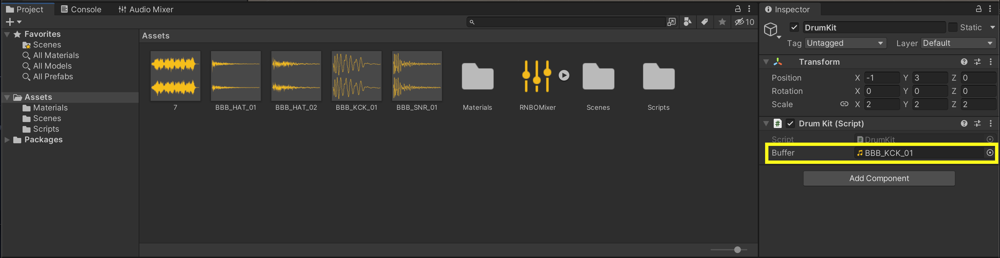

# Buffers and File Dependencies

The `buffer~` objects in our RNBO patch will create `externalDataRefs` in the exported patcher, which we can fill in Unity by loading an `AudioClip` with the plugin handle's `.LoadDataRef()` method.


To load an `AudioClip` into the `DataRef` identified with the above `"sampleOne"` buffer, we'll add an `AudioClip` field in Unity's inspector, get the samples and channels from whatever audio file we drag into that field, and load the data accordingly. 

```c#
using UnityEngine;

public class DrumKit : MonoBehaviour
{
    QuantizedBuffersHelper quantizedBuffersHelper;
    QuantizedBuffersHandle myQuantizedBuffersPlugin;

    const int instanceIndex = 1;

    [SerializeField] AudioClip buffer;

    void Start()
    {
        quantizedBuffersHelper = QuantizedBuffersHelper.FindById(instanceIndex);
        myQuantizedBuffersPlugin = quantizedBuffersHelper.Plugin;
        
        if (buffer)
          {
              float[] samples = new float[buffer.samples * buffer.channels];
              buffer.GetData(samples, 0);
              myQuantizedBuffersPlugin.LoadDataRef("sampleOne", samples, buffer.channels, buffer.frequency);
          }
    }

}
```



The script above has created a field `Buffer` in the inspector, which can take audio files that we've added into our Project.

- Next: [Sending and Receiving Messages](MESSAGES.md)
- Back to the [Table of Contents](README.md#table-of-contents)