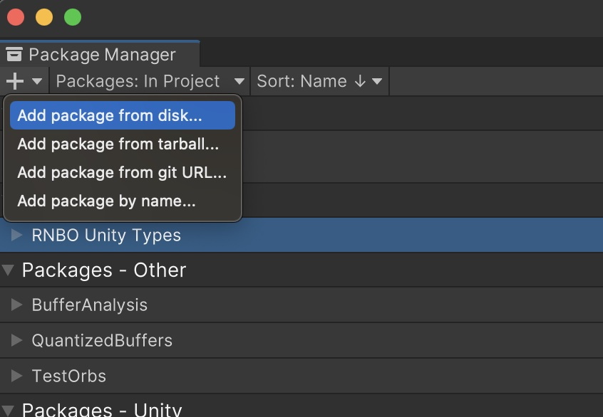
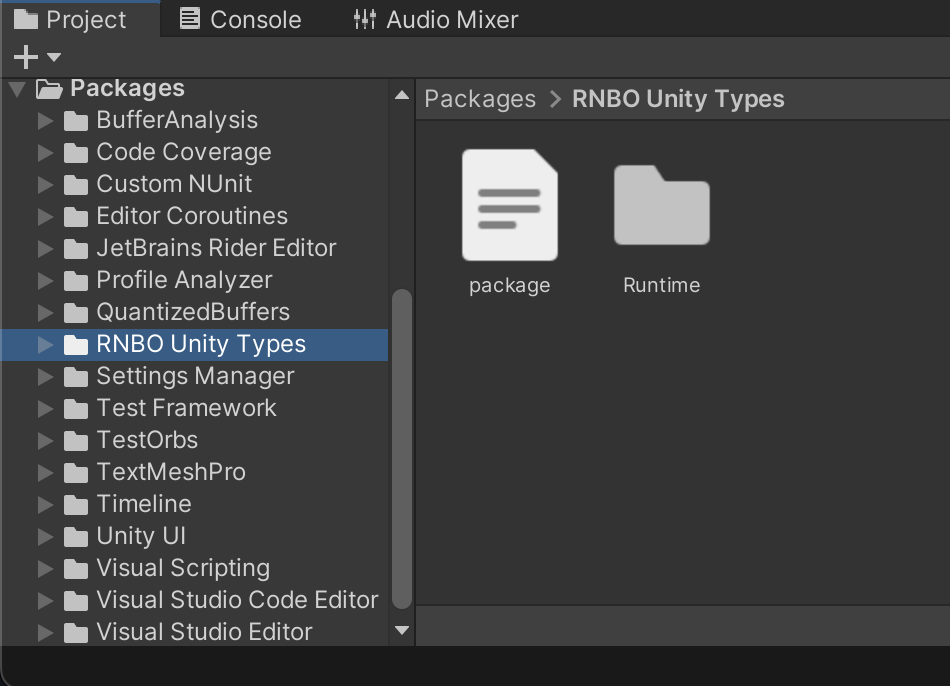
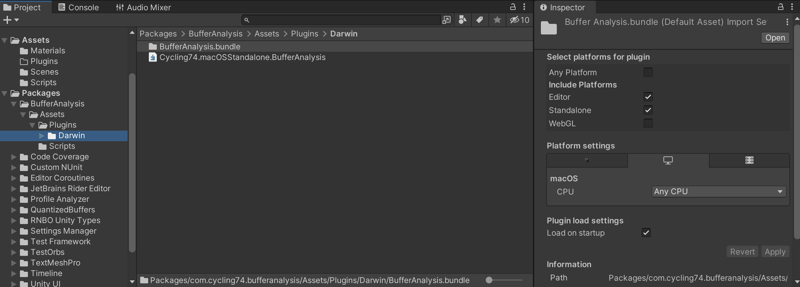
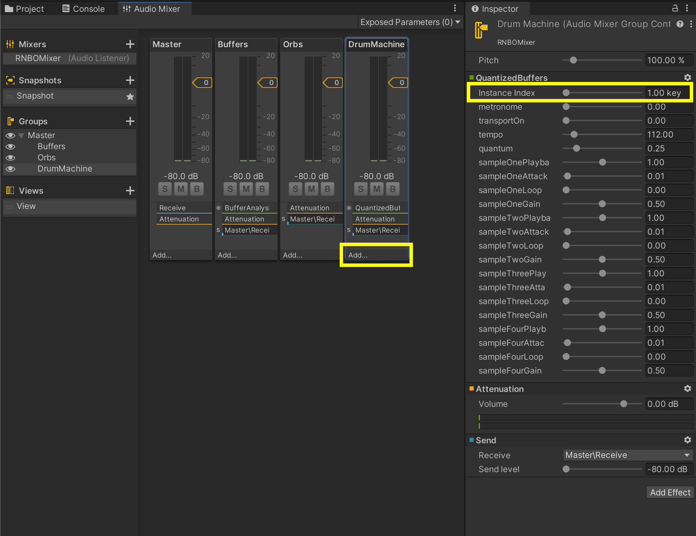

# Getting started

After you've followed the steps [in the README](../README.md) to build the package that contains your RNBO plugin, you can install that package, and the **RNBOTypes** package, using Unity's Package Manager. 

## Installation

You should use "Add package from disk..." via Unity's Package Manager to install both the **RNBOTypes** and the package containing your plugin.

In the dialog box that opens, select the package directory, and choose the file `package.json` to Open. 

***NB:** Please be sure to move the package you've built out of the `/build` directory and into some place safe on your machine. Installing the package will not necessarily copy its files into your Unity Project. If you delete your `/build` directory with the package still inside, your Unity Project will lose access to the package as well.*

This should result in the **RNBO Unity Types** package and the package named with the name you chose for your RNBO plugin added to the Installed Packages for your project. 

Inside the package for your plugin, there should be a directory called `/Assets` which includes your plugin in `Plugins` and the helper object in `Scripts`.

Find your plugin, which on macOS will be a `.bundle`, on Windows a `.dll`, and on Linux a `.so`, and select it so that it will open in Unity's Inspector.

In the Inspector, check "Load on Startup" and then "Apply."

Now you you should be able to load your RNBO plugin in your Unity project.

## Where you can load your RNBO Plugin

There are ways to add your RNBO plugin into your project—as a plugin loaded onto a track on an Audio Mixer, or by implementing a custom filter in a script attached as a Component to a GameObject. 

In this document, we'll discuss loading the plugin on an Audio Mixer. When you create a custom filter, you'll use many of the same methods to access your RNBO device, but the means of setting up the filter are distinct enough to warrant a seperate document. Visit [CUSTOMFILTER.md](CUSTOM_FILTER.md) for that guide.

### Loading your Plugin on an Audio Mixer

Create a new [Audio Mixer](https://docs.unity3d.com/Manual/AudioMixer.html) and add the RNBO plugin to a track as an effect—for example, the "Master" track—from the "Add..." dropdown menu.

Once you've added your plugin, set an instance index — this should be an **integer** that you will use in your scripts to refer to a specific *instance* of your plugin, loaded on this Audio Mixer. Note that although Unity's default GUI indicates you should be able to set a *float* value here, you should make sure to use a whole number. 

To hear your audio plugin in Unity, add an [Audio Source](https://docs.unity3d.com/Manual/class-AudioSource.html) and set its **Output** to the Master track of this Audio Mixer.

*Note that when a plugin is loaded on an Audio Mixer, it will by default create a GUI in the Inspector with sliders for each parameter. These sliders are not necessarily functional, nor do they accurately represent the current value of a parameter in your RNBO device, especially if you are setting those parameters via a C# script.*

- Next: [Addressing your RNBO Plugin from a C# Script](RNBO_SCRIPTING.md)
- Back to the [Table of Contents](README.md#table-of-contents)