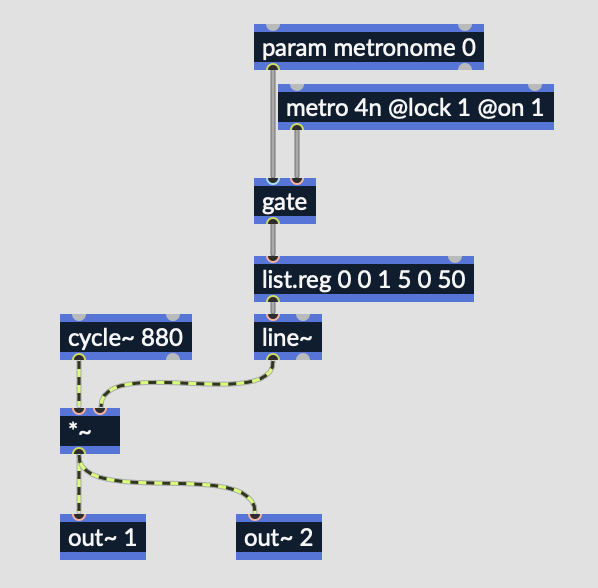

# Getting and Setting Parameters

The plugin handle provides a number of ways to set and get the value of a parameter in your RNBO device. Here, we'll get a parameter index based on a parameter ID string (the name we set for the parameter in RNBO), and use that index to set and get the value for that parameter.

Our Drum Kit RNBO patch has a metronome we can turn on and off using the `param` object called `metronome`.



To access this parameter in C#, we can do something like the following.

```csharp
using UnityEngine;

public class DrumKit : MonoBehaviour
{
    QuantizedBuffersHelper quantizedBuffersHelper;
    QuantizedBuffersHandle myQuantizedBuffersPlugin;

    const int instanceIndex = 1;

    readonly System.Int32 metronomeParam = (int)QuantizedBuffersHandle.GetParamIndexById("metronome");

    // This creates a field in Unity's inspector where we can set the value to pass to our metronomeParam
    [SerializeField] double metronomeOn = 1;

    void Start()
    {
        quantizedBuffersHelper = QuantizedBuffersHelper.FindById(instanceIndex);
        myQuantizedBuffersPlugin = quantizedBuffersHelper.Plugin;

        myQuantizedBuffersPlugin.SetParamValue(metronomeParam, metronomeOn);

    }
}
```

Here, we initialize a class property called `metronomeParam` which will hold the index of the `"metronome"` parameter in the array of all the parameters from our exported patch. This index is an integer of type `System.Int32`. 

We use the the plugin handle's `.GetParamIndexById()` method, which takes a string. We use the `(int)` cast here to handle the possibility that `.GetParamIndexByID()` returns `null`. You can read more about this [here](https://learn.microsoft.com/en-us/dotnet/csharp/language-reference/builtin-types/nullable-value-types). 

Then, in our `Start()` method, we use the `.SetParamValue()` method, called on our `Plugin`, to actually set the value of the parameter. Note that you could also use `.SetParamValueNormalized()` to set a normalized parameter value.

## Getting a parameter value

```csharp
    double isMetronomeOn;

    myQuantizedBuffersPlugin.GetParamValue(metronomeParam, out isMetronomeOn);

    Debug.Log("The value of [param metronome] is " + isMetronomeOn);
```

We could add the above to our `Start()` method in order to print the value of the `"metronomeParam"` parameter when the game starts. Note that `.GetParamValue()` is called on our `Plugin` and assigns the parameter value to a variable of type `double` using the `out` keyword. 

To get the normalized value, you could use `.GetParamValueNormalized()`.

- Next: [Buffers and File Dependencies](BUFFERS.md)
- Back to the [Table of Contents](README.md#table-of-contents)
