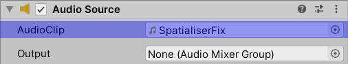
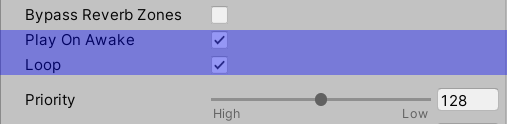
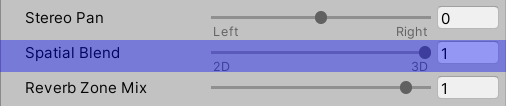
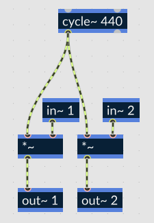

Spatialisation of RNBO generated audio effects in Unity can seem a bit convoluted. The following describes a simple method that does not require any external frameworks.

For this method we need to use a special sound file ([included in this repository]()) in our **Audio Source**, and use a couple of **`in~`** object in our rnbo~ patcher to apply the **Audio Source** spatialisation to the output of our RNBO generated audio effect.

The necessary steps are:
**In Unity**

1. Set the **Audio Source**'s **AudioClip** to our _SpatialiserFix.wav_ sound file.
	- 
2. Ensure the **Audio Source** is set to **Play On Awake** and **Loop**.
	- 
3. Set **Spatial Blend** to 1(_3D_).
	- 

**In RNBO~**
Multiply the output of your rnbo~ patcher with the stereo input from a couple of **`in~`** objects, like the section highlighted.

This will effectively apply the spatialisation that Unity applies to Audio Sources by default, to the output of our RNBO generated audio effect. While editing the rnbo~ patcher you may want to bypass the spatialisation section in order to hear the audio from your patcher.